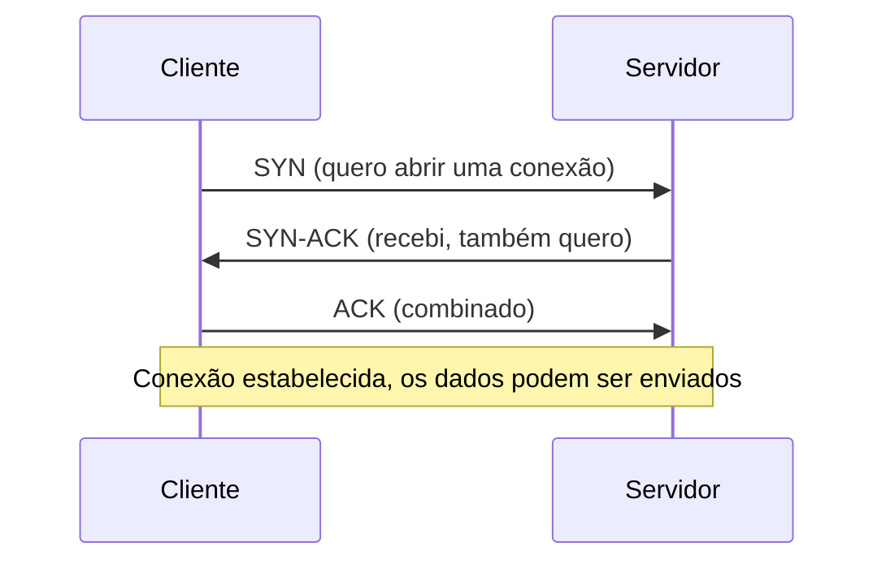
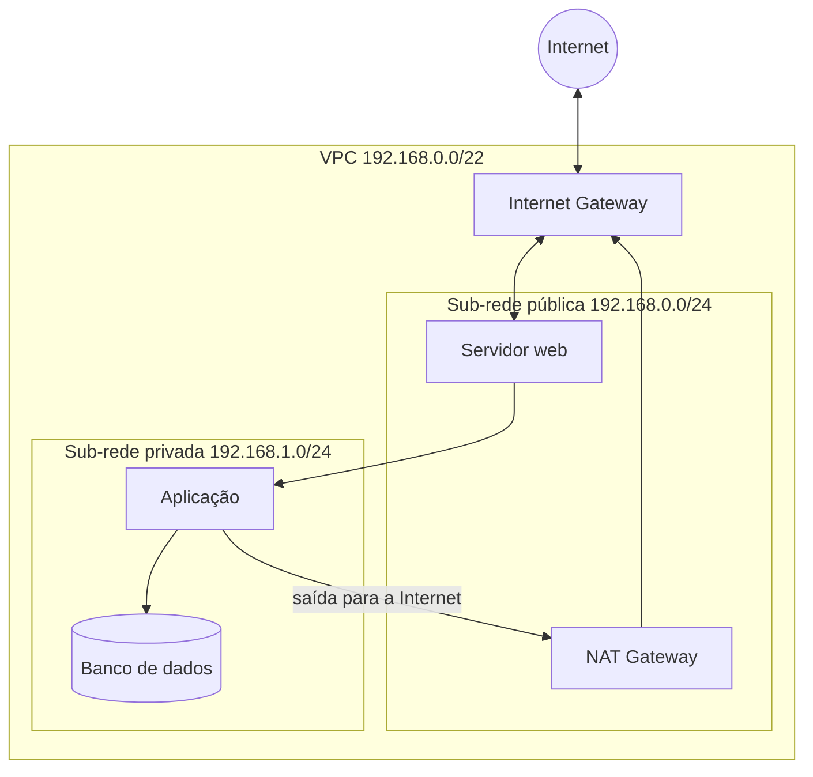

# Gerenciamento e Projeto de Redes

Nesta instrução, vamos falar especialmente de **mapeamento de redes locais usando IPv4 para criar redes e sub-redes**, mas também vamos transitar por:

1) Tipos de redes por abrangência (PAN, LAN, MAN e WAN);
2) Organização dos protocolos em camadas (Modelo OSI e modelo TCP/IP);
3) Topologias de redes;
4) TCP e UDP;
5) Protocolo IPv6 (comparado ao IPv4);
6) Endereçamento IPv4: máscara, CIDR, redes e sub-redes.

## Objetivos de aprendizagem

Ao final desta instrução, você deverá ser capaz de:

1. Diferenciar os tipos de rede (PAN, LAN, MAN e WAN) pela abrangência geográfica e reconhecer as principais topologias, explicando por que a estrela e a estrela estendida dominam as redes locais;
2. Explicar a função de cada camada do Modelo OSI e relacioná-las ao modelo TCP/IP, comparando os protocolos de transporte (TCP e UDP) e de rede (IPv4 e IPv6) para escolher o mais adequado a cada situação;
3. Calcular, a partir de um endereço IPv4 em notação CIDR, a máscara, o endereço de rede, o primeiro e o último endereço utilizável, o broadcast e a quantidade de hosts, aplicando esses cálculos para verificar se sub-redes pertencem a uma VPC e propor a divisão de um bloco CIDR no seu projeto.

## Pré-requisitos

* Conversão entre binário e decimal (há uma revisão rápida mais abaixo, na seção *"Basicamente, o que você precisa saber pra dominar esse trem?"*);
* Ter criado a VPC do projeto em uma das instruções anteriores.

# Vantagens no seu projeto

* Organizar suas aplicações em sub-redes privadas e seguras;
* Entender como a separação entre sub-rede pública e sub-rede privada protege a sub-rede privada, e o que de fato faz esse isolamento: as **tabelas de rotas**, o **Internet Gateway**, o **NAT Gateway**, os **security groups** e as **ACLs de rede**;
* Entender o mapeamento dessas sub-redes dentro da VPC que você criou para a empresa parceira.

## Tipos de redes por abrangência

As redes costumam ser classificadas pela **abrangência geográfica**, isto é, pelo tamanho da área que cobrem. O meio físico (cabo, fibra, rádio, satélite) **não define** o tipo da rede: ele é apenas o mais comum em cada escala.

| Tipo | Abrangência típica | Meios mais comuns | Exemplo |
|-|-|-|-|
| **PAN** (*Personal Area Network*) | poucos metros, ao redor de uma pessoa | dispositivos sem fio de curto alcance, em especial via **Bluetooth**; também USB e NFC | celular conectado a um fone e a um smartwatch |
| **LAN** (*Local Area Network*) | uma sala, um prédio ou um campus | **cabos** (par trançado e fibra) e **Wi-Fi** | computadores, notebooks, impressoras e servidores de um escritório |
| **MAN** (*Metropolitan Area Network*) | uma cidade ou região metropolitana | **fibra óptica** e **enlaces de rádio micro-ondas** ponto a ponto (equipamentos do tipo *minilink*) | rede que interliga os campi de uma universidade na mesma cidade |
| **WAN** (*Wide Area Network*) | estados, países e continentes | **fibra óptica** (inclusive cabos submarinos) e **satélite** | rede que interliga as filiais de uma empresa em estados diferentes |

E a Internet? A Internet não é "uma WAN": ela é uma **rede de redes**, a interconexão de milhares de redes independentes (LANs, MANs e WANs de provedores, empresas, universidades e governos) que falam os mesmos protocolos, os da família **TCP/IP**. É o maior exemplo de rede em escala mundial.

Em qualquer uma dessas escalas, o objetivo é conectar **hosts**, também chamados de **sistemas finais** ou *end devices*: computadores, celulares, servidores, sensores IoT. Os equipamentos que ficam no meio do caminho (switches, roteadores, pontos de acesso Wi-Fi) são chamados de **dispositivos intermediários**. Note que uma rede não precisa estar ligada à Internet para existir: a rede de uma fábrica pode ser totalmente isolada, por exemplo.

## Comunicação em camadas

Os hosts se comunicam usando diversos protocolos que trabalham de **camada N para camada N**. O que isso quer dizer?

* **Logicamente**, cada camada do remetente "conversa" com a **mesma camada** do destinatário, usando o mesmo protocolo: o HTTP do seu navegador conversa com o HTTP do servidor; o TCP do seu computador conversa com o TCP do servidor.
* **Fisicamente**, os dados descem pela pilha no remetente. Cada camada acrescenta o seu próprio cabeçalho (**encapsulamento**), os dados atravessam o meio físico como bits e, no destinatário, sobem pela pilha, com cada camada retirando o cabeçalho que a camada equivalente colocou (**desencapsulamento**).

Pense numa encomenda: você coloca o presente numa caixa (dados), a caixa vai num envelope com o nome do destinatário (transporte), o envelope vai num malote com o CEP da cidade (rede), e o malote vai no caminhão que faz o trecho até o próximo centro de distribuição (enlace). Cada etapa só olha a "etiqueta" que lhe interessa.

## Modelo OSI

O Modelo **OSI** (*Open Systems Interconnection*, padronizado pela ISO na norma ISO/IEC 7498-1) possui **7 camadas**. Ele é um **modelo de referência**, isto é, conceitual: organiza as funções de uma rede em camadas para facilitar o estudo, o projeto e a solução de problemas ("o problema é de camada 1 ou de camada 3?").

Os protocolos da Internet não seguem o OSI à risca, eles seguem o **modelo TCP/IP**, que você verá logo abaixo. Mas as funções descritas em cada camada existem de verdade e são implementadas em algum lugar: as camadas 1 e 2 ficam principalmente na **placa de rede** (NIC) e no seu *driver*; as camadas 3 e 4, no **sistema operacional**; as camadas 5, 6 e 7, na própria **aplicação** e em suas bibliotecas.

### Alguns destaques da figura

* A figura está em inglês e traz, na faixa inferior de cada camada, exemplos de protocolos e padrões;
* O **802.11** (Wi-Fi) aparece nas camadas 1 e 2, e isso está certo: o padrão define tanto a transmissão de rádio quanto o controle de acesso ao meio;
* Algumas posições são discutíveis, porque os protocolos da Internet foram criados para o TCP/IP e não "encaixam" perfeitamente no OSI: o **TLS/SSL** costuma ser tratado acima da camada de transporte (entre ela e a aplicação), e não dentro dela; o **ARP** atua na fronteira entre as camadas 2 e 3; **SIP** e **RTP** são normalmente classificados como protocolos de aplicação; o estabelecimento de conexão do **TCP** é função da camada 4, não da 5; e **Sockets** não são um protocolo de apresentação, mas a interface de programação (API) que a aplicação usa para acessar a camada de transporte.

### As 7 camadas

* **Camada 07 - Aplicação:** oferece serviços de rede diretamente às aplicações, por meio de protocolos como HTTP, DNS, SMTP e FTP. **Atenção:** ela **não** é "tudo o que aparece na sua tela". A tela (a interface gráfica) é responsabilidade do programa; o navegador é o programa, e o **HTTP** que ele usa para buscar a página é o protocolo de camada de aplicação;
* **Camada 06 - Apresentação:** é o **tradutor**. Define como os dados são representados para que os dois lados se entendam: codificação de caracteres (UTF-8), formatos de mídia (JPEG, MP3), serialização (JSON, XML), compressão e **criptografia/descriptografia**. Na Internet, essas funções normalmente ficam dentro da própria aplicação ou de bibliotecas como a do TLS;
* **Camada 05 - Sessão:** organiza o **diálogo** entre dois hosts: estabelece, mantém, sincroniza e encerra a sessão. É como uma **sessão de cinema**, que tem hora para começar e para acabar, com uma diferença importante: na rede, a duração **não é fixa**. A sessão dura enquanto as partes precisarem conversar, ou até ser encerrada por inatividade (*timeout*). Exemplos de funções de sessão: manter o seu login ativo enquanto você navega, encerrá-lo depois de um tempo parado e retomar uma transferência grande a partir de um ponto de controle (*checkpoint*). No mundo TCP/IP, essas funções costumam ser implementadas pela própria aplicação (por exemplo, com cookies e tokens de login);
* **Camada 04 - Transporte:** é a camada de transferência de dados **fim a fim** entre **processos** (aplicações) nos hosts, identificados por **portas**. É o **frete**: recebe os dados da aplicação, divide-os em **segmentos** e os entrega ao processo certo no destino. É a casa do **TCP** e do **UDP**. O TCP oferece entrega **confiável** (confirma o recebimento, retransmite o que se perdeu e reordena o que chegou fora de ordem); o UDP transporta sem essas garantias, em troca de menos atraso e menos sobrecarga. Veja a seção *TCP e UDP*;
* **Camada 03 - Rede:** faz o **endereçamento lógico** (endereço IP) e determina o caminho e a lógica de **roteamento** dos **pacotes** entre redes diferentes. É a casa do **IPv4** e do **IPv6**. Dispositivo típico: **roteador**;
* **Camada 02 - Enlace:** cuida da entrega entre dispositivos **vizinhos**, no mesmo enlace. Monta os **quadros** (*frames*), usa o **endereço físico** (endereço **MAC**, de 48 bits, gravado na placa de rede pelo fabricante, por exemplo `3C:52:82:1A:2B:4F`), detecta erros de transmissão e controla o acesso ao meio. Exemplos: Ethernet (IEEE 802.3) e Wi-Fi (IEEE 802.11). Dispositivo típico: **switch**;
* **Camada 01 - Física:** é a camada dos padrões **elétricos, eletrônicos, ópticos e mecânicos**: transforma bits em sinais (elétricos no cobre, luz na fibra, ondas de rádio no Wi-Fi) e define cabos, conectores (RJ45), tensões e frequências. Dispositivos típicos: cabos, conectores, repetidores e **hubs**.

### Modelo OSI x modelo TCP/IP

Na prática, a Internet usa o modelo **TCP/IP**, que junta algumas camadas do OSI. Muitos livros (como o de Kurose e Ross) usam uma versão com 5 camadas, separando enlace e física.

| Modelo OSI | Modelo TCP/IP | Exemplos |
|-|-|-|
| 7 - Aplicação, 6 - Apresentação, 5 - Sessão | Aplicação | HTTP, HTTPS (TLS), DNS, SSH, SMTP |
| 4 - Transporte | Transporte | TCP, UDP |
| 3 - Rede | Internet (Rede) | IPv4, IPv6, ICMP |
| 2 - Enlace, 1 - Física | Acesso à rede (Enlace + Física) | Ethernet, Wi-Fi |

### Encapsulamento: o nome dos dados em cada camada

Cada camada dá um nome diferente à sua unidade de dados (a **PDU**, *Protocol Data Unit*). Usar o nome certo ajuda a não confundir as coisas: "pacote" é da camada 3, "quadro" é da camada 2.

| Camada | Nome da PDU | O que é acrescentado |
|-|-|-|
| Aplicação | dados / mensagem | — |
| Transporte | **segmento** (TCP) ou **datagrama** (UDP) | cabeçalho com as **portas** de origem e destino |
| Rede | **pacote** | cabeçalho com os **endereços IP** de origem e destino |
| Enlace | **quadro** | cabeçalho com os **endereços MAC** e um campo de verificação de erros no final |
| Física | **bits** | sinais elétricos, ópticos ou de rádio |

### Dispositivos de rede por camada

| Dispositivo | Camada | O que faz |
|-|-|-|
| Hub | 1 - Física | repete o sinal recebido para **todas** as portas; todos os hosts disputam o mesmo meio |
| Switch | 2 - Enlace | aprende os endereços MAC e encaminha cada quadro **só** para a porta de destino |
| Roteador | 3 - Rede | encaminha pacotes **entre redes diferentes**, com base no endereço IP e na tabela de rotas |
| Firewall / security group | 3 e 4 (ou acima) | permite ou bloqueia tráfego por endereço IP, protocolo e porta |

## Demonstração de Montagem de Cabo UTP

A montagem do cabo é a **camada 1 na prática**. O cabo **UTP** (*Unshielded Twisted Pair*, par trançado sem blindagem) tem 8 fios, organizados em 4 pares trançados. O trançado não é enfeite: ele reduz a interferência eletromagnética e a interferência de um par sobre o outro (*crosstalk*). Em Ethernet sobre par trançado, o comprimento máximo de um enlace é de **100 metros**.

O conector usado é o **RJ45**, e a ordem das cores segue um de dois padrões da norma TIA-568:

| Pino | 1 | 2 | 3 | 4 | 5 | 6 | 7 | 8 |
|-|-|-|-|-|-|-|-|-|
| **T568A** | branco-verde | verde | branco-laranja | azul | branco-azul | laranja | branco-marrom | marrom |
| **T568B** | branco-laranja | laranja | branco-verde | azul | branco-azul | verde | branco-marrom | marrom |

* **Cabo direto:** o mesmo padrão nas duas pontas. É o mais usado;
* **Cabo cruzado (*crossover*):** T568A numa ponta e T568B na outra. Hoje é raramente necessário, porque a maioria dos equipamentos faz a inversão automaticamente (Auto-MDI/MDIX).

[VÍDEO: Crimpar cabo de rede com conector RJ45 (YouTube, 2018)](https://www.youtube.com/watch?v=OT_5EjDfD6M)

**Enquanto assiste, observe:** qual padrão de cores foi usado? O cabo montado é direto ou cruzado? Em que momento o trançado dos pares é desfeito, e por que esse trecho deve ser o mais curto possível?

## Topologias de Redes

A **topologia** descreve como os nós de uma rede estão interligados. Vale distinguir a **topologia física** (como os cabos e equipamentos estão ligados de fato) da **topologia lógica** (como os dados circulam). Os hosts podem ser organizados em algum dos tipos de topologia a seguir:

| Topologia | Como funciona | Vantagem | Desvantagem |
|-|-|-|-|
| **Barramento** (*Bus*) | todos os hosts compartilham um único cabo principal (*backbone*) | simples e barata | uma falha no cabo principal derruba todos; os hosts disputam o mesmo meio |
| **Estrela** (*Star*) | todos os hosts se ligam a um equipamento central | fácil de gerenciar e de expandir; a falha de um cabo afeta só um host | o equipamento central é um ponto único de falha |
| **Anel** (*Ring*) | cada host se liga a dois vizinhos, formando um ciclo | acesso ao meio ordenado (era o caso do antigo Token Ring) | uma falha pode interromper o anel, a menos que ele seja duplo |
| **Malha** (*Mesh*) | há vários caminhos entre os nós (malha completa ou parcial) | alta redundância: se um enlace cai, há outro caminho | cara e complexa; a malha completa com *n* nós exige *n*(*n* − 1)/2 enlaces |
| **Árvore** (*Tree*) | hierarquia de estrelas ligadas a um tronco | escalável e organizada por setores | uma falha no tronco afeta todos os ramos abaixo dele |
| **Ponto a ponto** (*Point-to-Point*) | enlace dedicado entre dois nós | simples e sem disputa pelo meio | não escala para muitos nós |

O mais comum para o ambiente de computadores é o **Estrela**, que também pode ser estendido para **Estrela Estendida** quando uma estrela dá origem a outra estrela. Na prática, é assim que se organiza a rede de um prédio: um equipamento central (núcleo) liga os equipamentos de cada andar, que por sua vez ligam os computadores.

> **Hub ou switch?** As figuras mostram **hubs** no centro das estrelas, como nas ilustrações clássicas. Nas redes atuais, esse papel é do **switch**. O hub (camada 1) repete tudo para todas as portas, e todos os hosts disputam o mesmo meio; o switch (camada 2) encaminha cada quadro só para a porta do destino, o que dá mais desempenho e mais segurança.

> **E na nuvem?** Numa VPC não há cabos à vista: a topologia é **lógica**, definida pelas sub-redes e pelas **tabelas de rotas**. Mesmo assim, o raciocínio é o mesmo, quem fala com quem, e por qual caminho.

## TCP e UDP

Os dois principais protocolos da camada de transporte entregam os dados ao **processo** certo no destino usando **portas**: números de 16 bits (de 0 a 65535). As portas de 0 a 1023 são as "bem conhecidas", reservadas a serviços padronizados. A combinação **endereço IP + porta** identifica uma ponta da comunicação, chamada de *socket*.

### TCP (*Transmission Control Protocol*)

O TCP é **orientado a conexão**: antes de enviar dados, cliente e servidor fazem o **three-way handshake** (aperto de mão em três etapas).

Depois disso, o TCP numera os segmentos, confirma o recebimento (ACK), **retransmite** o que se perdeu, **reordena** o que chegou fora de ordem e controla o ritmo de envio para não sobrecarregar o destinatário (controle de fluxo) nem a rede (controle de congestionamento).

> **"TCP garante a entrega"?** Quase. O TCP é **confiável**: ele detecta perdas e retransmite. Mas, se a rede estiver fora do ar, nenhum protocolo consegue entregar; nesse caso, o TCP avisa a aplicação de que a conexão falhou.

### UDP (*User Datagram Protocol*)

O UDP é **sem conexão**: envia cada **datagrama** sem handshake, sem confirmação, sem retransmissão e sem garantia de ordem. Parece pior, mas é justamente o que certas aplicações precisam: numa chamada de voz, um trecho de áudio que chega atrasado já não serve para nada, e retransmiti-lo só pioraria o atraso.

**Analogia:** o TCP é como uma encomenda registrada com aviso de recebimento, se o aviso não volta, a encomenda é reenviada, e as caixas são numeradas para serem abertas na ordem certa. O UDP é como distribuir panfletos: rápido e barato, mas ninguém confirma se cada um chegou.

### Comparação

| Característica | TCP | UDP |
|-|-|-|
| Conexão | orientado a conexão (handshake) | sem conexão |
| Confiabilidade | confirma, retransmite e reordena | não confirma, não retransmite, não reordena |
| Cabeçalho | 20 bytes ou mais | 8 bytes |
| Atraso | maior | menor |
| Usos típicos | páginas web (HTTP/1.1 e HTTP/2), SSH, e-mail, bancos de dados | DNS, voz e vídeo em tempo real, jogos online, DHCP |

> **Curiosidade:** o **HTTP/3** roda sobre o **QUIC**, um protocolo que usa UDP e implementa a própria confiabilidade por cima dele. Ou seja, "UDP não é confiável" descreve o UDP, não necessariamente a aplicação que o usa.

### Portas que você vai encontrar no projeto

| Serviço | Protocolo | Porta |
|-|-|-|
| SSH | TCP | 22 |
| DNS | UDP (e TCP para respostas grandes) | 53 |
| HTTP | TCP | 80 |
| HTTPS | TCP (e UDP no HTTP/3) | 443 |
| MySQL | TCP | 3306 |
| PostgreSQL | TCP | 5432 |

É aqui que transporte e sub-redes se encontram: uma regra de **security group** na nuvem combina exatamente **protocolo + porta + origem em notação CIDR**. Por exemplo: "permitir TCP na porta 443 vindo de `0.0.0.0/0`" (qualquer endereço) no servidor web da sub-rede pública.

## Protocolo IPv4 vs IPv6

A figura a seguir aponta as principais diferenças.

Sobre a figura:

* As datas indicam quando cada protocolo foi **especificado**: o IPv4 no RFC 791, de 1981 (ele entrou em operação na ARPANET em 1983); o IPv6 no RFC 2460, de 1998, atualizado pelo RFC 8200, de 2017;
* "Endereços precisam ser reutilizados e mascarados" refere-se ao uso de **endereços privados** com **NAT** (*Network Address Translation*), a saída encontrada para a escassez de endereços IPv4;
* "Cada dispositivo tem um endereço exclusivo" significa que, com IPv6, há endereços globais suficientes para todos, sem NAT. Na prática, uma mesma interface costuma ter **vários** endereços IPv6 (um *link-local*, um global e, muitas vezes, endereços temporários de privacidade);
* A forma simplificada do exemplo segue duas regras: zeros à esquerda de cada grupo podem ser omitidos (`0000` vira `0`), e **uma única** sequência de grupos só de zeros pode ser trocada por `::`. Assim, `50b2:6400:0000:0000:6c3a:b17d:0000:10a9` vira `50b2:6400::6c3a:b17d:0:10a9`.

Resumo da comparação, incluindo diferenças que a figura não mostra:

| Aspecto | IPv4 | IPv6 |
|-|-|-|
| Tamanho do endereço | 32 bits | 128 bits |
| Quantidade de endereços | 232 ≈ 4,3 bilhões | 2128 ≈ 3,4 × 1038 |
| Notação | decimal, 4 octetos separados por ponto | hexadecimal, 8 grupos de 16 bits separados por dois-pontos |
| Broadcast | existe | **não existe**: é substituído por multicast |
| Descoberta do endereço MAC do vizinho | ARP | NDP (*Neighbor Discovery*, via ICMPv6) |
| Configuração automática | DHCP | SLAAC e/ou DHCPv6 |
| Cabeçalho | de 20 a 60 bytes, com checksum | fixo de 40 bytes, sem checksum |
| Fragmentação | pode ser feita pelos roteadores | só pela origem |
| Sub-rede típica de uma LAN | varia (/24, /26, ...) | /64 |

Nesta instrução, todos os cálculos serão feitos **só com IPv4**, porque é o que usaremos no projeto. Mas atenção: o IPv6 **também é usado em redes locais**. Os sistemas operacionais atuais ativam o IPv6 por padrão (toda interface com IPv6 tem ao menos um endereço *link-local*, que começa com `fe80::`), muitas redes funcionam em **pilha dupla** (*dual stack*, IPv4 e IPv6 ao mesmo tempo) e a AWS permite associar blocos IPv6 a VPCs e sub-redes.

## Redes e Sub-redes

Uma **rede IP** é um conjunto de endereços que compartilham o mesmo **prefixo** (os mesmos bits iniciais). Dividir uma rede em redes menores, as **sub-redes**, permite criar hierarquias de estações de trabalho dentro de uma organização. Por exemplo, numa instituição de ensino, pode existir a sub-rede dos alunos, a dos professores e a administrativa.

Hosts de sub-redes diferentes **podem** se comunicar, mas só passando por um **roteador** (na nuvem, pelo roteador virtual da VPC). É nesse ponto de passagem que aplicamos critérios de segurança: tabelas de rotas, firewalls, ACLs e security groups decidem quem pode falar com quem. Além da segurança, segmentar a rede reduz o alcance do broadcast (cada sub-rede tem o seu), organiza a administração e facilita encontrar problemas.

Para organizar essas redes dentro de redes, usamos a notação **CIDR** (*Classless Inter-Domain Routing*, "roteamento entre domínios **sem classes**", definido hoje no RFC 4632).

### Por que "sem classes"?

Até 1993, os endereços IPv4 eram divididos em **classes**, cada uma com uma máscara fixa:

| Classe | Primeiro octeto | Máscara padrão | Uso |
|-|-|-|-|
| A | 0 a 127 (0 e 127 são reservados) | 255.0.0.0 (/8) | redes muito grandes |
| B | 128 a 191 | 255.255.0.0 (/16) | redes médias |
| C | 192 a 223 | 255.255.255.0 (/24) | redes pequenas |
| D | 224 a 239 | — | multicast |
| E | 240 a 255 | — | experimental |

Esse esquema desperdiçava muitos endereços: uma empresa com 300 hosts não cabia numa classe C (254 hosts) e recebia uma classe B inteira (65.534 hosts). Já era possível criar sub-redes dentro de uma classe (RFC 950, de 1985), mas o CIDR foi além: acabou com as classes e permitiu **prefixos de qualquer tamanho**, escritos com uma barra depois do endereço. Em `10.0.0.0/26`, o **/26** diz que os **26 primeiros bits** são o prefixo da rede.

As classes ainda aparecem em nomes de faixas e em provas de certificação, por isso vale conhecê-las; mas o endereçamento atual, inclusive o da sua VPC, é todo **sem classes**.

### Endereços especiais que você vai encontrar

| Bloco | Para que serve |
|-|-|
| `127.0.0.0/8` | *loopback*: o próprio host (`127.0.0.1` é o `localhost`) |
| `169.254.0.0/16` | *link-local*: autoconfiguração quando o DHCP falha; na AWS, `169.254.169.254` é o serviço de metadados da instância |
| `0.0.0.0/0` | "qualquer endereço": aparece como **rota padrão** nas tabelas de rotas e como origem nas regras de security group |
| `100.64.0.0/10` | faixa compartilhada usada por provedores de Internet com (CGNAT)[https://github.com/agodoi/m07cc-semana08/blob/main/doc/cgnat.md] (RFC 6598) |
| Faixas privadas (RFC 1918) | uso interno em qualquer organização, você vai descobrir o CIDR delas no **Desafio**, no final |

## Basicamente, o que você precisa saber pra dominar esse trem?

| Fazer conversão de binário para decimal. |
|-|

Cada octeto tem 8 bits, e cada posição vale uma potência de 2:

| Posição do bit | 8º | 7º | 6º | 5º | 4º | 3º | 2º | 1º |
|-|-|-|-|-|-|-|-|-|
| Valor | 128 | 64 | 32 | 16 | 8 | 4 | 2 | 1 |

Para converter, some os valores das posições que têm bit 1. Exemplos:

* `11000000` = 128 + 64 = **192**
* `00101011` = 32 + 8 + 2 + 1 = **43**
* `00111111` = 32 + 16 + 8 + 4 + 2 + 1 = **63**

Numa máscara, os bits 1 vêm sempre **juntos, da esquerda para a direita**. Por isso, um octeto de máscara só pode ter estes valores:

| Quantidade de bits 1 no octeto | 0 | 1 | 2 | 3 | 4 | 5 | 6 | 7 | 8 |
|-|-|-|-|-|-|-|-|-|-|
| Valor do octeto | 0 | 128 | 192 | 224 | 240 | 248 | 252 | 254 | 255 |

Potências de 2 que aparecem o tempo todo:

| 22 | 23 | 24 | 25 | 26 | 27 | 28 | 210 | 211 | 215 | 216 |
|-|-|-|-|-|-|-|-|-|-|-|
| 4 | 8 | 16 | 32 | 64 | 128 | 256 | 1.024 | 2.048 | 32.768 | 65.536 |

E as três fórmulas que resolvem quase tudo (com *n* = número do CIDR):

* **Bits de host:** *h* = 32 − *n*
* **Total de endereços do bloco:** 2*h*
* **Hosts utilizáveis:** 2*h* − 2 (descontamos o endereço de rede e o de broadcast). **Na AWS**, são 2*h* − 5, porque a AWS reserva mais três endereços em cada sub-rede.

## Exemplo 01 [detalhado]:

### Dado o IP 10.0.0.0/26

O **/26** significa que o prefixo CIDR tem 26 bits, então os **26 primeiros bits são fixos** e identificam a rede: é uma máscara de 26 bits "1". Sobram 32 − 26 = **6 bits de host**, que **variam** dentro da faixa. Esses bits não são irrelevantes (são eles que identificam cada host), mas, para encontrar a faixa, vamos marcá-los com **X**.

Sua missão é:

a) Qual é a máscara de rede?

b) Qual é o endereço de rede?

c) Qual é o primeiro endereço IPv4 utilizável?

d) Qual é o endereço de broadcast da rede?

e) Qual é o último endereço IPv4 utilizável?

f) Quantos hosts cabem nessa rede?

### a) Máscara de rede

A **máscara de sub-rede** é um número de 32 bits, escrito do mesmo jeito que um endereço IP, que indica quais bits do endereço pertencem à **rede** (bits **1**) e quais pertencem ao **host** (bits **0**). É ela que permite dividir uma rede IP em sub-redes menores: quanto mais bits 1, menor a sub-rede.

Para o exemplo dado **/26**, são 26 bits 1 seguidos de 6 bits 0:

|1 1 1 1 1 1 1 1 | 1 1 1 1 1 1 1 1 | 1 1 1 1 1 1 1 1 | 1 1 0 0 0 0 0 0 |
|-|-|-|-|
| 255 | 255 | 255 | 192 |

> Na máscara, os bits de host são **sempre 0**. Por isso o último octeto vale 128 + 64 = 192. O **X** que usaremos a partir de agora **não faz parte da máscara**: é só uma marcação visual para as posições do **endereço** que podem variar (1 1 X X X X X X).

### b) Endereço de rede é o primeiro endereço da faixa (quando os bits X são só ZERO):

Pegue o IP original dado no enunciado:

| 10 | 0 | 0 | 0 |
|-|-|-|-|

Escreva-o em binário e alinhe com a máscara. Nas posições em que a máscara tem **1**, o bit do IP é mantido; nas posições em que a máscara tem **0**, está a parte de host, os bits flexíveis **X**:

| | 1º octeto | 2º octeto | 3º octeto | 4º octeto |
|-|-|-|-|-|
| **IP 10.0.0.0** | 0 0 0 0 1 0 1 0 | 0 0 0 0 0 0 0 0 | 0 0 0 0 0 0 0 0 | 0 0 0 0 0 0 0 0 |
| **Máscara /26** | 1 1 1 1 1 1 1 1 | 1 1 1 1 1 1 1 1 | 1 1 1 1 1 1 1 1 | 1 1 0 0 0 0 0 0 |
| **Resulta em** | 0 0 0 0 1 0 1 0 | 0 0 0 0 0 0 0 0 | 0 0 0 0 0 0 0 0 | 0 0 X X X X X X |

Em decimal, fica:

| 10 | 0 | 0 | 0 0 X X X X X X |
|-|-|-|-|

Finalmente, coloque **0** no lugar dos **X** para encontrar o endereço da rede, porque o endereço de rede é sempre o primeiro endereço possível:

| 10 | 0 | 0 | 0 0 0 0 0 0 0 0 |
|-|-|-|-|

Que é o mesmo que **10.0.0.0**.

> O nome técnico do que acabamos de fazer é **AND lógico bit a bit** entre o IP e a máscara (1 AND 1 = 1; qualquer outra combinação dá 0). É exatamente o que um roteador faz para descobrir a qual rede um endereço pertence. Neste exemplo, o IP dado já era o endereço de rede, então nada mudou. No **Exemplo 02** você verá o AND "zerar" bits de um endereço de host.

### c) Qual é o primeiro IP útil disponível?

É sempre o primeiro após o endereço da rede (endereço de rede + 1). Portanto:

| 10 | 0 | 0 | 0 0 0 0 0 0 0 1 |
|-|-|-|-|
| 10 | 0 | 0 | 1 |

> Exceções: em um **/31** (usado em enlaces ponto a ponto, RFC 3021) os dois endereços são utilizáveis, e um **/32** representa um único host. E, na AWS, os endereços de rede + 1, + 2 e + 3 são reservados (veja *Agora pense!*).

### d) Qual o endereço de broadcast da rede?

É o último endereço da faixa: quando os **X** flexíveis são sempre **1**:

| 10 | 0 | 0 | 0 0 1 1 1 1 1 1 |
|-|-|-|-|

Resulta em:

| 10 | 0 | 0 | 63 |
|-|-|-|-|

porque 0 0 1 1 1 1 1 1 = 32 + 16 + 8 + 4 + 2 + 1 = 63.

O broadcast é o endereço usado para enviar uma mensagem a **todos** os hosts da sub-rede de uma só vez; por isso, ele não pode ser atribuído a nenhum host. (Lembre-se: o IPv6 não tem broadcast.)

### e) Qual é o último endereço ÚTIL da faixa?

É o endereço **imediatamente anterior ao broadcast** (broadcast − 1), ou seja, o penúltimo endereço da faixa.

| 10 | 0 | 0 | 62 |
|-|-|-|-|

### f) Qual é a quantidade de hosts possíveis nessa rede?

É só contar a quantidade de endereços do 1º até um antes do broadcast, que nesse caso será do 1 ao 62; portanto, 62 hosts possíveis de serem endereçados nessa rede. Em outras palavras, cabem 62 máquinas ou *end-points* nessa rede.

Em vez de contar, use a fórmula: com *h* = 6 bits de host, são 26 − 2 = 64 − 2 = **62** hosts. O "− 2" desconta o endereço de rede e o de broadcast.

> **Na AWS**, uma sub-rede /26 teria 26 − 5 = **59** endereços utilizáveis.

**Respostas:**
- Máscara de sub-rede: 255.255.255.192
- Endereço de rede: 10.0.0.0
- 1º endereço útil: 10.0.0.1
- Endereço de broadcast: 10.0.0.63 (último endereço)
- Último endereço útil: 10.0.0.62
- Quantidade de hosts possíveis: 62
- Total de endereços do bloco: 64 (de 10.0.0.0 a 10.0.0.63)

### Atalho: o tamanho do bloco

Depois de entender o método binário, dá para acelerar. Olhe o octeto da máscara que não é 0 nem 255 (o "octeto interessante") e calcule **256 − valor desse octeto**. O resultado é o **tamanho do bloco**: as redes começam em múltiplos dele.

No Exemplo 01: 256 − 192 = **64**. As redes /26 começam em 0, 64, 128 e 192. O IP 10.0.0.0 está no bloco de 0 a 63; logo, a rede é 10.0.0.0 e o broadcast é 10.0.0.63.

## Exemplo 02: dado o IP 172.16.1.43/28
#### a) Qual é a máscara de sub-rede?
#### b) Qual é o endereço de rede?
#### c) Qual é o primeiro endereço IPv4 utilizável?
#### d) Qual é o endereço de broadcast da rede?
#### e) Qual é o último endereço IPv4 utilizável?
#### f) Quantos hosts são possíveis?

**Respostas:**
- Máscara de sub-rede: 255.255.255.240
- Endereço de rede: 172.16.1.32
- 1º IPv4 utilizável: 172.16.1.33
- Endereço de broadcast: 172.16.1.47 (último)
- Último IPv4 utilizável: 172.16.1.46
- Quantidade de hosts possíveis: 14

<b>Resolução comentada</b> (tente antes de abrir)

Este é o primeiro exemplo em que o IP dado **não** é o endereço de rede: 43 é um host no meio da faixa.

* /28 → 24 + 4: os três primeiros octetos são 255 e o quarto tem 4 bits 1 → `11110000` = **240**. Máscara: 255.255.255.240;
* Bits de host: 32 − 28 = 4;
* AND no último octeto:

| | Último octeto |
|-|-|
| IP (43) | 0 0 1 0 1 0 1 1 |
| Máscara (240) | 1 1 1 1 0 0 0 0 |
| Resulta em | 0 0 1 0 X X X X |

* Com os X em 0: `00100000` = **32** → rede 172.16.1.32;
* Com os X em 1: `00101111` = **47** → broadcast 172.16.1.47;
* Primeiro útil: 32 + 1 = 33; último útil: 47 − 1 = 46;
* Hosts: 24 − 2 = **14** (na AWS: 24 − 5 = 11).

**Pelo atalho:** 256 − 240 = 16. Blocos: 0, 16, **32**, 48... O 43 está entre 32 e 47.

## Exemplo 03: dado o IP 10.0.8.0/21
#### a) Qual é a máscara de sub-rede?
#### b) Qual é o endereço de rede?
#### c) Qual é o primeiro endereço IPv4 utilizável?
#### d) Qual é o endereço de broadcast da rede?
#### e) Qual é o último endereço IPv4 utilizável?
#### f) Quantos hosts são possíveis?

**Respostas:**
- Máscara de sub-rede: 255.255.248.0
- Endereço de rede: 10.0.8.0
- 1º IPv4 utilizável: 10.0.8.1
- Endereço de broadcast: 10.0.15.255
- Último IPv4 utilizável: 10.0.15.254
- Quantidade de hosts possíveis: 2046

<b>Resolução comentada</b> (tente antes de abrir)

Agora o "octeto interessante" é o **terceiro**.

* /21 → 8 + 8 + 5: o terceiro octeto tem 5 bits 1 → `11111000` = **248**. Máscara: 255.255.248.0;
* Bits de host: 32 − 21 = **11** (3 no terceiro octeto + 8 no quarto);
* Tamanho do bloco no terceiro octeto: 256 − 248 = 8. Blocos: 0, **8**, 16, 24... O 8 está no bloco de 8 a 15;
* Rede: 10.0.8.0; broadcast: terceiro octeto 15 e quarto octeto todo em 1 → 10.0.15.255;
* Hosts: 211 − 2 = 2048 − 2 = **2046**.

> **Pegadinha:** aqui, endereços como 10.0.8.255 e 10.0.9.0 são **hosts válidos**. Um endereço terminado em 255 ou em 0 só é broadcast ou rede se todos os bits de host forem 1 ou 0 e, num /21, os bits de host começam no terceiro octeto.

## Exemplo 04: dado o IP 10.0.128.0/17
#### a) Qual é a máscara de sub-rede?
#### b) Qual é o endereço de rede?
#### c) Qual é o primeiro endereço IPv4 utilizável?
#### d) Qual é o endereço de broadcast da rede?
#### e) Qual é o último endereço IPv4 utilizável?
#### f) Quantos hosts são possíveis?

**Respostas:**
- Máscara de sub-rede: 255.255.128.0
- Endereço de rede: 10.0.128.0
- 1º IPv4 utilizável: 10.0.128.1
- Endereço de broadcast: 10.0.255.255
- Último IPv4 utilizável: 10.0.255.254
- Quantidade de hosts possíveis: 2^15 - 2 = 32.766

<b>Resolução comentada</b> (tente antes de abrir)

* /17 → 8 + 8 + 1: o terceiro octeto tem 1 bit 1 → `10000000` = **128**. Máscara: 255.255.128.0;
* Bits de host: 32 − 17 = **15**;
* Tamanho do bloco no terceiro octeto: 256 − 128 = 128. Blocos: 0 e **128**. O 128 está no bloco de 128 a 255;
* Rede: 10.0.128.0; broadcast: 10.0.255.255;
* Hosts: 215 − 2 = 32.768 − 2 = **32.766**.

## Exemplo 05: dado o IP 10.0.1.64/26
#### a) Qual é a máscara de sub-rede?
#### b) Qual é o endereço de rede?
#### c) Qual é o primeiro endereço IPv4 utilizável?
#### d) Qual é o endereço de broadcast da rede?
#### e) Qual é o último endereço IPv4 utilizável?
#### f) Quantos hosts são possíveis?

**Respostas:**
- Máscara de sub-rede: 255.255.255.192
- Endereço de rede: 10.0.1.64
- 1º IPv4 utilizável: 10.0.1.65
- Endereço de broadcast: 10.0.1.127
- Último IPv4 utilizável: 10.0.1.126
- Quantidade de hosts possíveis: 2^6 - 2 = 62

<b>Resolução comentada</b> (tente antes de abrir)

É o mesmo /26 do Exemplo 01, mas em outro bloco: compare as duas resoluções.

* Máscara: 255.255.255.192 (igual ao Exemplo 01);
* Tamanho do bloco: 256 − 192 = 64. Blocos: 0, **64**, 128, 192. O 64 está no bloco de 64 a 127;
* Rede: 10.0.1.64; primeiro útil: 10.0.1.65; broadcast: 10.0.1.127; último útil: 10.0.1.126;
* Hosts: 26 − 2 = **62**.

# Agora pense!

Numa das instruções, você criou uma VPC 192.168.0.0/22.

### Dado o IP 192.168.0.0/22
#### a) Qual é a máscara de sub-rede?
#### b) Qual é o endereço de rede?
#### c) Qual é o primeiro endereço IPv4 utilizável?
#### d) Qual é o endereço de broadcast da rede?
#### e) Qual é o último endereço IPv4 utilizável?
#### f) Quantos hosts são possíveis?

## E também criou uma sub-rede pública 192.168.0.0/24 e uma sub-rede privada 192.168.1.0/24

> **O que torna uma sub-rede "pública" ou "privada"?** Não é o endereço: as duas usam endereços **privados** (192.168.x.x). O que muda é a **tabela de rotas**. A sub-rede pública tem uma rota `0.0.0.0/0` apontando para o **Internet Gateway**; a privada não tem essa rota (quando precisa sair para a Internet, por exemplo para baixar atualizações, ela usa um **NAT Gateway** que fica na sub-rede pública, e ninguém de fora consegue iniciar uma conexão com ela).

#### a) Qual é a máscara de cada sub-rede?
#### b) Qual é o endereço de rede de cada sub-rede?
#### c) Qual é o primeiro endereço IPv4 utilizável de cada sub-rede?
#### d) Qual é o endereço de broadcast de cada sub-rede?
#### e) Qual é o último endereço IPv4 utilizável de cada sub-rede?
#### f) Quantos hosts são possíveis em cada sub-rede?

### g) As sub-redes de fato estão dentro da VPC? Justifique!

## Agora, projete!

#### h) Quantas sub-redes /24 ainda cabem na VPC sem sobrepor as que já existem? Quais são elas?
#### i) Na AWS, quantos endereços de cada sub-rede /24 podem de fato ser usados por instâncias? Quais endereços são reservados, e por quê?
#### j) Na AWS, cada sub-rede fica inteira dentro de uma única **zona de disponibilidade** (AZ). Para ter alta disponibilidade, proponha um plano de endereçamento, dentro da mesma VPC /22, com uma sub-rede pública e uma privada em cada uma de **duas** AZs.
#### k) Escreva a regra de entrada de um security group que permita que **somente** hosts da sub-rede pública acessem um banco PostgreSQL na sub-rede privada. (Dica: protocolo, porta e origem.)

<b>Gabarito</b> (tente antes de abrir)

**VPC 192.168.0.0/22**
- Máscara: 255.255.252.0
- Endereço de rede: 192.168.0.0
- 1º IPv4 utilizável: 192.168.0.1
- Broadcast: 192.168.3.255
- Último IPv4 utilizável: 192.168.3.254
- Hosts possíveis: 210 − 2 = 1.022 (na AWS, os hosts ficam nas sub-redes, e é nelas que as reservas se aplicam)

**Sub-rede pública 192.168.0.0/24** e **sub-rede privada 192.168.1.0/24**

| | Pública | Privada |
|-|-|-|
| Máscara | 255.255.255.0 | 255.255.255.0 |
| Endereço de rede | 192.168.0.0 | 192.168.1.0 |
| 1º utilizável | 192.168.0.1 (na AWS: 192.168.0.4) | 192.168.1.1 (na AWS: 192.168.1.4) |
| Broadcast | 192.168.0.255 | 192.168.1.255 |
| Último utilizável | 192.168.0.254 | 192.168.1.254 |
| Hosts | 254 (na AWS: 251) | 254 (na AWS: 251) |

**g)** Sim. A VPC vai de 192.168.0.0 a 192.168.3.255. A pública (192.168.0.0 a 192.168.0.255) e a privada (192.168.1.0 a 192.168.1.255) estão inteiras dentro dessa faixa e não se sobrepõem. Em binário: os 22 primeiros bits das duas sub-redes são iguais aos da VPC (no terceiro octeto, 0 = `000000|00` e 1 = `000000|01`: os 6 primeiros bits são iguais).

**h)** Duas: 192.168.2.0/24 e 192.168.3.0/24 (ou, juntas, um bloco 192.168.2.0/23).

**i)** 251 endereços por sub-rede /24. A AWS reserva cinco: o endereço de rede (.0), o roteador da VPC (.1), o servidor DNS da AWS (.2), um endereço para uso futuro (.3) e o último (.255), porque a VPC não suporta broadcast.

**j)** Uma solução possível, usando os quatro blocos /24 da VPC:

| Sub-rede | AZ | CIDR |
|-|-|-|
| Pública A | AZ a | 192.168.0.0/24 |
| Privada A | AZ a | 192.168.1.0/24 |
| Pública B | AZ b | 192.168.2.0/24 |
| Privada B | AZ b | 192.168.3.0/24 |

Outras divisões são válidas (por exemplo, sub-redes /25 para deixar espaço livre), desde que nenhuma se sobreponha e todas fiquem dentro de 192.168.0.0/22.

**k)** No security group do banco, uma regra de **entrada**: protocolo **TCP**, porta **5432**, origem **192.168.0.0/24**. Como o security group é *stateful*, as respostas do banco saem automaticamente, sem regra extra. Boa prática: em vez do CIDR, usar como origem o **security group** da aplicação, para que a regra continue certa mesmo se os IPs mudarem. (Se você fez o item **j**, lembre-se de incluir também a sub-rede pública da segunda AZ.)

# Desafio

A título de curiosidade, as faixas de IP usadas em redes locais (e na sua VPC) são as faixas **privadas**, definidas no RFC 1918. Qualquer organização pode usá-las internamente sem pedir autorização a ninguém, mas elas **não são roteadas na Internet pública**: para sair para a Internet, o tráfego passa por **NAT** (na VPC, quem faz essa tradução é o Internet Gateway, para instâncias com IP público, e o NAT Gateway, para a sub-rede privada). Por isso, às vezes elas são chamadas informalmente de faixas "gratuitas", mas o termo correto é **privadas**.

> Curiosidade: justamente porque o IPv4 **público** é escasso, provedores de nuvem como a AWS passaram a cobrar por endereço IPv4 público a partir de 2024.

### Descubra o CIDR de cada faixa de endereços privados abaixo:

- Faixa classe A: 10.0.0.0 a 10.255.255.255

- Faixa classe B: 172.16.0.0 a 172.31.255.255

- Faixa classe C: 192.168.0.0 a 192.168.255.255

**Dica:** escreva em binário o octeto que muda entre o início e o fim da faixa e conte quantos bits ficam iguais. Para a faixa B, compare 16 = `00010000` com 31 = `00011111`.

<b>Gabarito</b> (tente antes de abrir)

- 10.0.0.0**/8** — só o primeiro octeto é fixo;
- 172.16.0.0**/12** — 8 bits do primeiro octeto + os 4 primeiros bits do segundo (`0001`), que são iguais em 16 e em 31;
- 192.168.0.0**/16** — os dois primeiros octetos são fixos.

Repare que a sua VPC, 192.168.0.0/22, é um pedaço da faixa 192.168.0.0/16.

# Kahoot!
